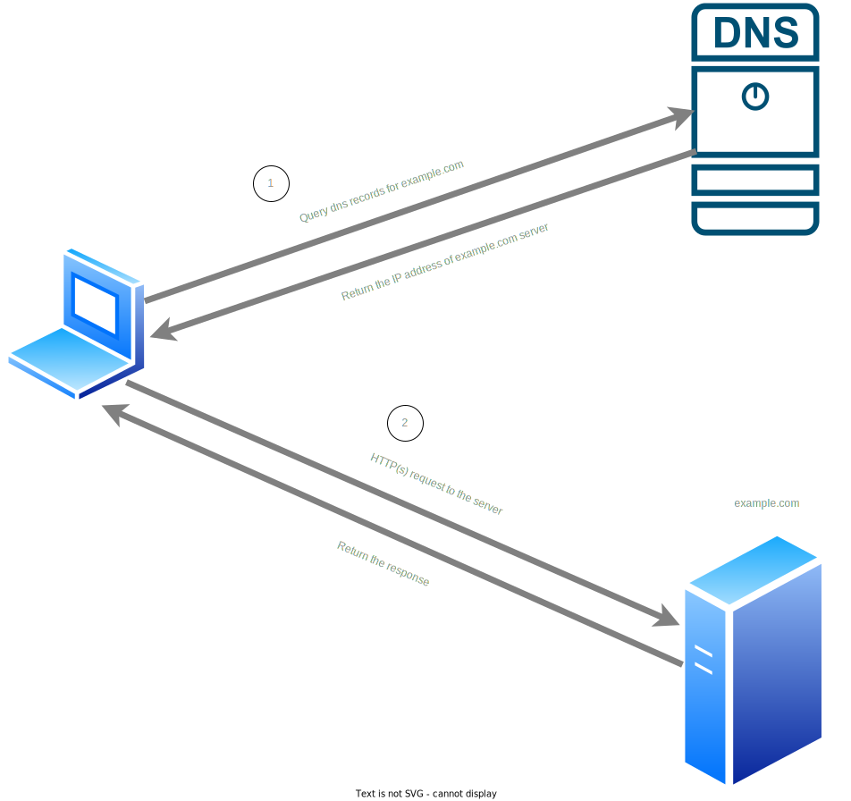
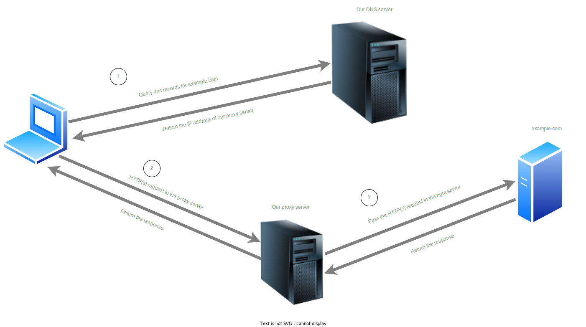

# Proxy by DNS
## Introduction
Proxy by DNS is technic for hiding IP address from online services(websites and such) by using a proxy implicitly. <br/>
Which means that you don't need to set proxy on each client but you can set a DNS at network level, in a router settings for example.<br/>
It can also be useful for apps that don't have proxy support and don't follow system proxy.
> Note that it is not a replacement for a VPN and not as secure.
## How does it work?
Basically a normal HTTP(s) request looks like following diagram:



You make a query a DNS record for a domain name IP address and you send a HTTP(s) request for the IP address.


In our case we have following setup:




We have our own DNS server which does'nt return a right IP address but it returns the IP address of our proxy server and proxy server will send the request on our behalf which make our IP hidden to the online service.<br/>
> Note that DNS and proxy services can on same server 

## What about TLS? Is it a man-in-the-middle?
Dealing with TLS might not look a straight forward thing.<br/> 
But NO its not a man-in-the-middle and no TLS decryption happens and the destination server name is found using SNI.<br/>

## Configuration
The only configuration that is needed is setting the IP address of the proxy server in the [`dnsmasq.conf`](https://github.com/AlirezaDastyar/proxy-by-dns/blob/main/dnsmasq/dnsmasq.conf#L10) file.
```properties
address=/#/100.0.0.0
```
Change the `100.0.0.0` to the IP address of proxy server (could be same as DNS server IP address)

## Run it
Assuming that you are running both services(DNS and proxy) on the same machine.<br/>
Do following steps:
1. ```git clone git@github.com:AlirezaDastyar/proxy-by-dns.git```
1. Do the [configuration](https://github.com/AlirezaDastyar/proxy-by-dns#configuration)
1. ```docker compose up -d --build```

## Use it
In order to use it just set the ip address of the DNS server as you'r network DNS. 
## Troubleshoot 
It is known to fail to run `dnsmasq` in some environments, exiting with `Permission denied` error.<br> 
If that happens try to uncomment the `user: root` in [`docker-compose.yml`](https://github.com/AlirezaDastyar/proxy-by-dns/blob/main/docker-compose.yml#L7) file as a work around while is not a good practice.
